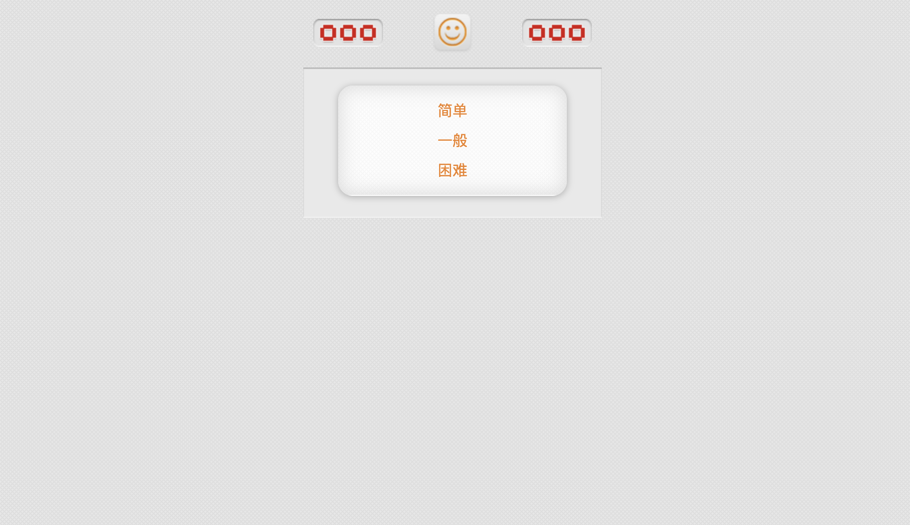
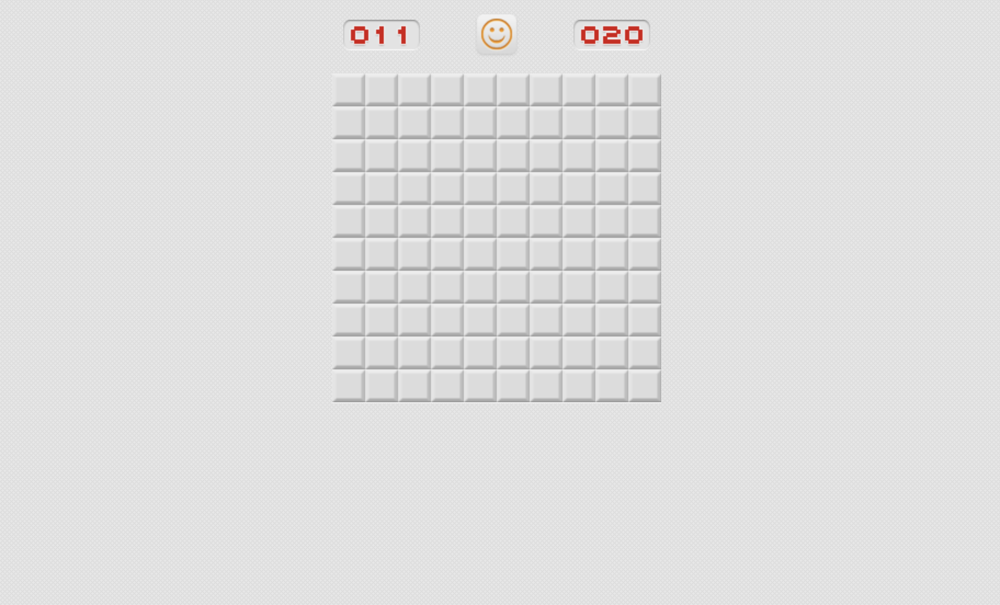

# Online Minesweeper 🎮

一个基于 HTML+CSS+JavaScript 开发的在线扫雷游戏单页源码，无需安装即可在浏览器中直接运行。完整实现经典扫雷逻辑，提供多难度模式和流畅交互体验。





## 功能特性 ✨

- **多级难度模式**  
  - 预设难度：简单（10x10，20雷）、一般（20x20，50雷）、困难（30x30，100雷）
  - 自定义模式：可自由设置雷区尺寸和地雷数量
- **动态数据展示**  
  - 实时计时器（最高999秒）  
  - 剩余雷数统计看板
- **高效交互设计**  
  - 左键翻开方块/右键标记地雷  
  - 自动展开空白区域  
  - 数字提示周围雷数
- **状态反馈系统**  
  - 失败时触发爆炸动画  
  - 胜利时展示庆祝特效
- **即时重启功能**  
  - 点击笑脸按钮重置当前难度  
  - 游戏结束后自由切换模式

## 技术实现 🛠️
### 核心架构
- **HTML5 Canvas** 渲染动态游戏网格
- **CSS3 动画** 实现按钮点击反馈和提示框过渡效果
- **原生 JavaScript** 处理游戏逻辑与事件交互

### 性能优化
- 采用 **图像预加载** 技术确保资源就绪
- 实现 **分层渲染**（网格层/方块层分离）减少重绘
- 使用 **空间分区算法** 优化相邻方块计算
- 通过 **事件委托** 提升交互响应速度

## 项目结构 📁

```bash
.
├── index.html          # 页面主框架
├── style.css           # UI样式与动画定义
├── Mclear.js           # 核心逻辑（地图生成/胜负判断/事件处理）
├── mian.js             # 资源预加载模块
└── images/             # 资源文件
    ├── restart.png     # 数字与按钮素材
    ├── bg.png          # 背景纹理
    ├── bg2.png         # 对话框背景
    ├── defeat.gif      # 失败动画
    └── victory.gif     # 胜利动画
```

## 设计亮点 💡
- **极简视觉设计**  
  采用扁平化风格，通过明快的橙灰配色提升可读性，控制按钮布局符合 F型视觉动线
- **响应式交互**  
  右键标记即时反馈，长按显示按压状态，数字块使用高对比度配色
- **错误防御机制**  
  首次点击必为安全区域，自动排除无效坐标操作

## 兼容性说明 ⚠️
- 需现代浏览器支持 ES6+ 语法
- 推荐 Chrome 90+/Firefox 88+/Edge 90+ 
- 移动端暂未适配触屏手势

## 扩展方向 🔮
- [ ] 添加音效反馈系统
- [ ] 实现玩家成绩排行榜
- [ ] 开发教学模式与提示功能
- [ ] 支持触屏设备操作适配

## 开源协议 📜
本项目基于 MIT 协议开源，欢迎提交 PR 或 Issue 共同改进！